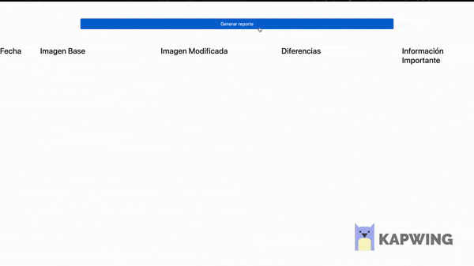

# Taller-VRT

# Integrante

- Miller Andrés Trujillo - 201517402
- Cristian Martinez Bedoya - 201818747

Para correrlo es necesario ejecutar primero `npm install` y posteriormente `npm start`.

Esto desplegará un servidor en el puerto 3000 y podrá acceder a través de `http://localhost:3000` a él. Ahí verá la página de reportes y cada vez que presione el botón se generará uno.

## Aplicación

- Link de la aplicación [acá](https://cmartinezbjmu.github.io/miso-4208-vrt/palette.html).
- Link al repositorio de la aplicación [acá](https://github.com/cmartinezbjmu/miso-4208-vrt).

## Imagenes

Los pantallazos tomados por cypress se pueden encontrar [acá](https://github.com/matrujillo10/taller-vrt/tree/master/public/images).

## Aplicación de automatización

- Link del repositorio con la aplicación de automatización [acá](https://github.com/matrujillo10/taller-vrt).

### Funcionamiento

La aplicación de automatización tiene dos componentes: FrontEnd y Backend.

Esta aplicación nos permite capturar imágenes de la aplicación creada para cambiar colores y hacer captura de pantalla, este proceso se puede hacer 3 veces desde el Front y las imágenes serán puestas en la aplicación. El Back se encarga de procesar estas imágenes con ResambleJS y muestra también las diferencias en esta aplicación.

## Demo

## Preguntas

#### ¿Qué información puedo obtener de una imagen al usar resembleJS y que significado tiene cada uno de los componentes de la respuesta?.

ResembleJS permite comparar dos imagenes y encontrar sus diferencias, entre sus componentes se encuentra:

- Autoescalar la imagen con respecto al dimensionamiento de la otra imagen a comparar
- Cambiar el método de comparación entre las imágenes: 
- Cambiar el estilo de visualización de la salida de la comparación: Permite cambiar el estilo en que muestra la salida de las comparaciones, entre los cambios permite cambiar el color de la distinción, transparencia, entre otros.
- Reducir el área de comparación: Permite disminuir el área de comparación para hacerlo más eficiente

#### ¿Qué información puedo obtener al comparar dos imagenes?

Al comparar las imágenes permite ver las diferencias que se encuentran entre ellas, la información que podemos obtener son visualmente áreas resaltadas con color donde se encuentran diferencias. 

#### ¿Qué opciones se pueden seleccionar al realizar la comparación?

Entre las opciones para la comparación nos permite hacer pruebas de regresión CSS, personalizar la salida de las comparaciones, limitar las regiones de comparación e ignorar regiones de la misma imagen.
